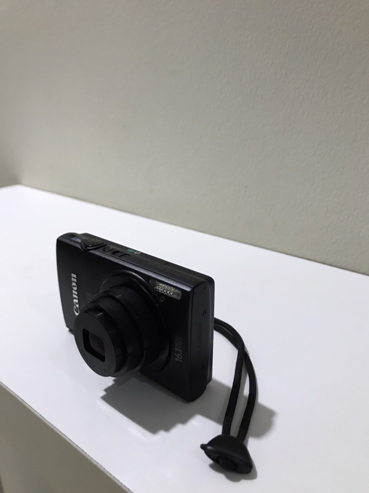

# Computer Graphics Task

* Vincent Yonathan    - 05111940000186
---
## Branches
* First Task - *main* branch
* Second Task (3D) - *second3d* branch and hackathon

## Item's Name : Camera
### Top Right

### Top Left

### Top
<!--  -->

### Top Rear

### Chosen Picture 
#### Left Picture
<!--  -->

#### Right Picture 

